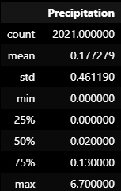

# Honolulu, Hawaii Climate Analysis and App
SQLAlchemy-Challenge

## Introduction
The project aims to assist you in analyzing and visualizing Honolulu, Hawaii climate data using Python, SQLAlchemy, Pandas, and Matplotlib. Below, you'll find instructions on how to perform a comprehensive climate analysis and then design a Flask API App.

## Imports and Setup
    # Python SQL toolkit and Object Relational Mapper
    import sqlalchemy
    from sqlalchemy.ext.automap import automap_base
    from sqlalchemy.orm import Session
    from sqlalchemy import create_engine, func, inspect
    from sqlalchemy.orm import Session, declarative_base

Connect to your SQLite database using SQLAlchemy's `create_engine()` function.

    engine = create_engine("sqlite:///../Resources/hawaii.sqlite")

Reflect your tables into classes using `automap_base()` and save references to the station and measurement classes.

    engine = create_engine("sqlite:///../Resources/hawaii.sqlite")
    Base.prepare(autoload_with=engine)
    Base.classes.keys()

Output: ['measurement', 'station']

    Station = Base.classes.station
    Measurement = Base.classes.measurement

Create a SQLAlchemy session to link Python to the database.

    session = Session(engine)

**Important Note:** Remember to close your session at the end of your analysis.

## Part 1: Analyze and Explore the Climate Data

### Precipitation Analysis

Find the most recent date in the dataset.

    year = dt.datetime.strptime(last_date.date, '%Y-%m-%d')
    minus_one_year = year - dt.timedelta(days = 365)

Output: datetime.datetime(2017, 8, 23, 0, 0)

Retrieve the previous 12 months of precipitation data.

    precip = session.query(Measurement.date, Measurement.prcp).\
    filter(Measurement.date.between(\
    func.strftime('%Y-%m-%d', minus_one_year),
    func.strftime('%Y-%m-%d', year))).all()

Load the query results into a Pandas DataFrame, set column names, and sort by date.

    precip_df = pd.DataFrame(precip, columns= ['Date', 'Precipitation'])
    precip_df.set_index('Date', inplace=True)

Plot the results using Matplotlib and print summary statistics.

*Precipitation observations for the previous one year.*

*Summary Statistics*

### Exploratory Station Analysis

Calculate the total number of stations in the dataset.

    session.query(func.count(Station.station)).all()

Output: [(9,)]

Identify the most-active stations and their observation counts.

    act_stations = session.query(Measurement.station, func.count(Measurement.station)).\
    group_by(Measurement.station).\
    order_by((func.count(Measurement.station).desc())).all()

    Output: 

    [('USC00519281', 2772),
    ('USC00519397', 2724),
    ('USC00513117', 2709),
    ('USC00519523', 2669),
    ('USC00516128', 2612),
    ('USC00514830', 2202),
    ('USC00511918', 1979),
    ('USC00517948', 1372),
    ('USC00518838', 511)]

Determine the lowest, highest, and average temperatures for the most-active station.

    most_act_station = session.query(Measurement.station, 
                    func.min(Measurement.tobs), func.max(Measurement.tobs), func.avg(Measurement.tobs)).\
                    filter(Measurement.station == "USC00519281").all()

    Output: [('USC00519281', 54.0, 85.0, 71.66378066378067)]

Query the previous 12 months of temperature observation data for the most-active station and plot the results as a histogram.

    most_active_st_yr = [row.tobs for row in session.query(Measurement.tobs).\
    filter(Measurement.station == "USC00519281", Measurement.date.between(\
    func.strftime('%Y-%m-%d', minus_one_year),
    func.strftime('%Y-%m-%d', year))).all()]

*Most active station's temperature observations for the previous one year.*

    # Close Session
    session.close()

## Part 2: Design Climate App - Flask API based on queries:

### Imports and Setup

    # Import the dependencies.
    import numpy as np
    import sqlalchemy
    from sqlalchemy.ext.automap import automap_base
    from sqlalchemy.orm import Session
    from sqlalchemy import create_engine, func
    import datetime as dt
    from flask import Flask, jsonify

    #################################################
    # Database Setup
    #################################################
    engine = create_engine("sqlite:///../Resources/hawaii.sqlite")

    # reflect an existing database into a new model
    Base = automap_base()
    # reflect the tables
    Base.prepare(autoload_with=engine)

    # Save references to each table
    Station = Base.classes.station
    Measurement = Base.classes.measurement

    # Create our session (link) from Python to the DB
    session = Session(engine)

    #################################################
    # Flask Setup
    #################################################
    app = Flask(__name__)

Homepage: Start at the homepage and list all available routes.

    #Home Page
    @app.route("/")
    def welcome():
        """List all available api routes."""
        return (
            f"Welcome to my Climate App! "
            f"Available Routes: "
            f"/api/v1.0/precipitation "
            f"/api/v1.0/stations "
            f"/api/v1.0/tobs "
            f"/api/v1.0/&lt;start&gt; "
            f"/api/v1.0/&lt;start&gt;/&lt;end&gt; "
        )

Preciption Route - Return JSON representation of the last 12 months of precipitation data.

    @app.route("/api/v1.0/precipitation")
    def precipitation():

        # Create our session (link) from Python to the DB
        session = Session(engine) 

        # Find the most recent date in the data set.
        last_date = session.query(Measurement.date).order_by(Measurement.date.desc()).first()

        # Calulate last year
        year = dt.datetime.strptime(last_date.date, '%Y-%m-%d')
        minus_one_year = year - dt.timedelta(days = 365)

        # Perform a query to retrieve the data and precipitation scores
        precip = session.query(Measurement.date, Measurement.prcp).\
        filter(Measurement.date.between(\
        func.strftime('%Y-%m-%d', minus_one_year),
        func.strftime('%Y-%m-%d', year))).all()

        session.close()

        #Return the JSON representation of your dictionary.
        query_precip = []
        for date, prcp in precip:
            p_dict = {}
            p_dict[date] = prcp #date as key and prcp as value
            query_precip.append(p_dict)
        return jsonify(p_dict)

Stations Route - Return a JSON list of stations from the dataset.

    @app.route("/api/v1.0/stations")
    def stations():
        
        session = Session(engine)

        # Query station list
        stations_list = session.query(Measurement.station).\
            group_by(Measurement.station).all()
        
        session.close()

        #Return the JSON list.
        stations_all = list(np.ravel(stations_list))
        return jsonify(stations_all)

/api/v1.0/tobs: Return a JSON list of temperature observations for the most-active station in the last year.

    @app.route("/api/v1.0/tobs")
    def tobs():
        session = Session(engine)

        #Query the dates and temperature observations of the 
        # most-active station for the previous year of data.
        last_date = session.query(Measurement.date).order_by(Measurement.date.desc()).first()
        year = dt.datetime.strptime(last_date.date, '%Y-%m-%d')
        minus_one_year = year - dt.timedelta(days = 365)

        most_active_st_yr = session.query(Measurement.date, Measurement.tobs).\
            filter(Measurement.station == "USC00519281", Measurement.date.between(\
            func.strftime('%Y-%m-%d', minus_one_year),
            func.strftime('%Y-%m-%d', year))).all()
        
        session.close()

        #Return a JSON list of temperature observations for the previous year.
        tobs_results = []
        for date, tobs in most_active_st_yr:
            t_dict = {}
            t_dict[date] = tobs
            tobs_results.append(t_dict)
        return jsonify(t_dict)

Start and End Route-  Return JSON list of temperature statistics (TMIN, TAVG, TMAX) for specified start or start-end range.

    @app.route("/api/v1.0/<start>")
    def st_temp_range(start):
        session = Session(engine)

        last_date = session.query(Measurement.date).order_by(Measurement.date.desc()).first()
        #minimum temperature, the average temperature, and the maximum temperature for a specified start.
        start_result = session.query(Measurement.date,func.max(Measurement.tobs),func.avg(Measurement.tobs),func.min(Measurement.tobs)).\
            filter(Measurement.date.between(\
                    start,
                    last_date.date)).\
            group_by(Measurement.date).\
            order_by(Measurement.date).all()
        session.close()

        #Return a JSON list
        start_tobs=[]
        for date, tmin, tavg, tmax in start_result:
            tobs_start_dict={}
            tobs_start_dict["Date"] = date
            tobs_start_dict["TMIN"] = tmin
            tobs_start_dict["TAVG"] = tavg
            tobs_start_dict["TMAX"] = tmax
            start_tobs.append(tobs_start_dict)
        return jsonify(start_tobs)  
    #################################################
    #end route -
    @app.route("/api/v1.0/<start>/<end>")
    def end_temp_range(start, end):
        session = Session(engine)

        #minimum temperature, the average temperature, and the maximum temperature for a specified start-end range.
        start_result = session.query(Measurement.date,func.max(Measurement.tobs),func.avg(Measurement.tobs),func.min(Measurement.tobs)).\
            filter(Measurement.date.between(\
                    start,
                    end)).\
            group_by(Measurement.date).\
            order_by(Measurement.date).all()
        session.close()

        #Return a JSON list
        start_end_tobs=[]
        for date, tmin, tavg, tmax in start_result:
            tobs_start_end_dict = {}
            tobs_start_end_dict["Date"] = date
            tobs_start_end_dict["TMIN"] = tmin
            tobs_start_end_dict["TAVG"] = tavg
            tobs_start_end_dict["TMAX"] = tmax
            start_end_tobs.append(tobs_start_end_dict)
        return jsonify(start_end_tobs)  

### Results: Sample images from start/end route 
*Screenshot of before date input.*

*Screenshot of after date input (Aug 12-17, 2010).*

Run the app

    if __name__ == "__main__":
        app.run(debug=True)

## Resources
#### 1. Used all SQLAlchemy activities to help write code.
#### 2. Used np.ravel() for stations list. 
- https://www.educative.io/answers/what-is-the-numpyravel-function-from-numpy-in-python 
- https://numpy.org/doc/stable/reference/generated/numpy.ravel.html
#### 3. Used Flask API URL route registration when dealing with troubleshooting. 
- https://flask.palletsprojects.com/en/latest/api/#url-route-registrations