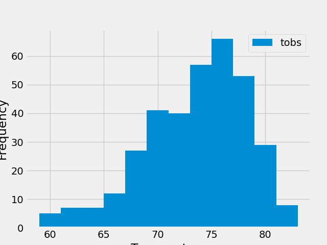

# SQLAlchemy-Challenge
## Part 1: Analyze and Explore the Climate Data
### Figures from Climate analysis jupyter notebook

#### 1. Precipitation observations for the previous one year.

#### 2. Most active station's temperature observations for the previous one year.

## Part 2: Design Your Climate App
### Climate App Flask API - Sample images from start/end route 
#### 1. Screenshot of before date input.

#### 1. Screenshot of after date input (Aug 12-17, 2010).

## Resources
#### 1. Used all SQLAlchemy activities to help write code.
#### 2. Used np.ravel() for stations list. 
- https://www.educative.io/answers/what-is-the-numpyravel-function-from-numpy-in-python 
- https://numpy.org/doc/stable/reference/generated/numpy.ravel.html
#### 3. Used Flask API URL route registration when dealing with troubleshooting. 
- https://flask.palletsprojects.com/en/latest/api/#url-route-registrations